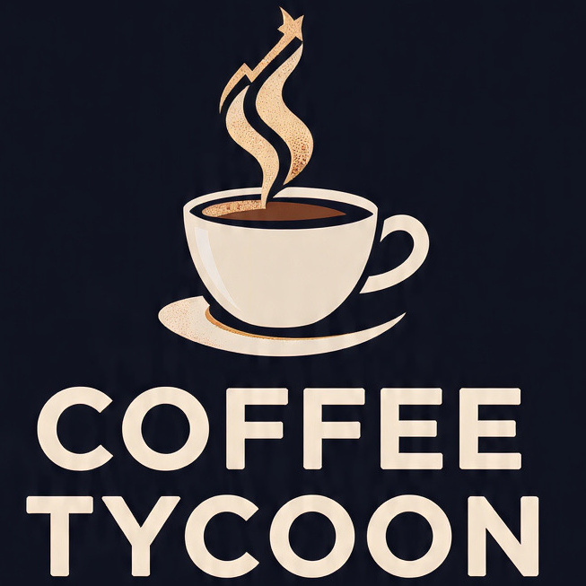

# Coffee Tycoon



A game where you brew coffee

---

## Contents
- [How to Download and Play](#how-to-download-and-play)
  - [Option 1: File](#option-1-file)
  - [Option 2: Link](#option-2-link)
- [Updates](#updates)
  - [Latest Version](#latest-version-v111-a-latte-noise)
- [Undecided Additions](#undecided-additions)

---

## How to Download and Play

### Option 1: File
1 Download the **coffeetycoon.html** file  
   
2 Save the file to your computer  
   
3 Open the HTML file in any modern browser (Chrome, Edge, Firefox, Opera, etc.)  
   
4 Enjoy brewing your coffee empire

### Option 2: Link
- Play directly in your browser: [Coffee Tycoon Online](https://coffeetycoon.github.io/)

---

## Updates

### Latest Version: v1.13.3 – Instant Brew
**Release Date:** Feb 8, 2026

**Key Features**
- Instant Number Updates: All numbers now update instantly without delay or animation
- Golden Coffee Spending: Multiplier and Golden Coffee displays update immediately when spending
- Progress Bar Updates: Prestige and Golden Upgrade progress bars now update instantly
- Smoother UI Experience: Removed animation delays for a more responsive game feel

### Previous Version: v1.13.2 – Golden Gains
**Release Date:** Feb 8, 2026

**Key Features**
- Golden Coffee System: Prestige to earn Golden Coffee for permanent production multipliers
- Golden Upgrades: Permanent upgrades that don't reset after prestige, including automation features
- Offline Coffee Calculation: Earn coffee while away from the game (5+ minute threshold)
- Settings Panel: New settings button with customizable options for notifications, quick keys, number display, and progress reset
- Save Export/Import: Export your game progress as a text string and import it on another device or browser
- Erase Progress: Option to completely reset your game progress with confirmation
- Extended Number Support: Number abbreviations now support up to trigintillion (10^96) for massive late-game progress

---

## Future Updates

### v1.14 – Grab a Lab
- Research Lab as Golden Upgrade (new main tab)
- Discover ~10 drink recipes with buffs/debuffs
- Max 3 active drinks at a time
- Swaps regenerate over time
- Golden Upgrades for building
- Offline CPS, takes the current time and the time you last played (saved in user data), and gives you the amount of coffee you should have (if you had been playing that whole time)
- Coffee display change, it displays instant change in coffee every 0.1 sec, rather than delayed as it is now

### v1.15 – Roasters and Coasters
- Roastery as Golden Upgrade (new main tab)
- Buy and process beans into blends (Light, Medium, Dark, French etc.)
- Activate blends for temporary global boosts
- Golden Upgrades for building
- each bean starts as 1 billion cps cost, and scales by 1.15x depending on the number of beans you have purchased in a lifetime

### v1.16 – Super Coffee
- Randomly spawning Super Coffee with temporary bonuses (spawns as a button in a random spot on screen)
- Occasional Golden Super Coffee (need to purchase with stronger buffs
- Coffee storms temporarily boost all CPS 2×–5×
- Achievements for collecting Super Coffees
- Chance to spawn Mystery Coffee Beans for rare boosts

### v1.17 – Stats Window
- Stats button with tabs for total coffee, CPS, golden coffee
- Graphs for each building and combined CPS
- Historical coffee production timeline
- Filter CPS by building or upgrade type
- Tooltip hover to see exact numbers
- Will show lifetime stats for everything

---

## Undecided Additions
- Mobile UI
  - Sidebar navigation instead of tabs
  - Adjusted touch controls for phones/tablets

---

#### Only used for major update when necessary
```javascript
// ===== One-time global reset for Coffee Tycoon vx.x.x =====
const GAME_VERSION = "x.x.x-reset"; // Change this if want another one-time reset

// Check stored version
const savedVersion = localStorage.getItem("gameVersion");

// If version doesn't match (or no version found), wipe save and set new version

if (savedVersion !== GAME_VERSION) {
  
  console.log("Performing one-time global reset for Coffee Tycoon vx.x.x");
  
  localStorage.clear(); // completely reset all player progress
  
  localStorage.setItem("gameVersion", GAME_VERSION);

}
```
---
*Stay tuned for more updates as coffee tycoon improves!*
